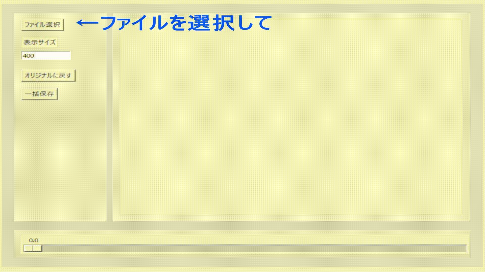

# markscanに読む前に、画像を二値化する
* markscanでは「しきい値」のスライドバーで、グレースケール画像を白黒画像に切り分ける、しきい値を設定します。しかし、設定がうまくいっているのかどうかわかりません。
* このソフトでは、しきい値にたいする二値化の様子をリアルタイムで見ながら画像を二値化していくことができます。
* 二値化するファイルは、複数選択可能です、ファイル選択の画面で複数選択してください。変換先の画像ファイルは、ソフトと同じ場所に保存されます。



## 使い方
* [リリースのページ](https://github.com/phys-ken/image_thresholding_for_markscan/releases/tag/0.1)から最新版の**markscan_bw.exe**をダウンロードしてください。
  * bwは、ブラックホワイトのつもりです...
* **ファイルを選択**から、マークシート画像を選択してください。複数選択も可能です。
* 右端の印がしっかりと見えるようなしきい値を、スライドバーで設定してください。
* 保存ボタンを押すと、フォルダと同じ場所に**bw**というフォルダが作成され、その中に画像が作成されます。
* あとは使用しやすい場所にbwフォルダを移動してから、markscanで読み取ってください。しきい値は、150くらいでよいはず。

## 参考にしたサイト
* [Python tkinter / リアルタイム2値化アプリを作ってみた](https://torimakujoukyou.com/tkinter-binarization-gui/)
  * こちらのサイトで紹介されているスクリプトを、日本語対応・複数ファイル対応させて、pyinstallerでexe化しました。
* [Python OpenCV で日本語を含むパス及びファイルが読み取れない問題](https://qiita.com/amaguri0408/items/d4167a6e81e4f9866a71)

[TOPへ戻る](https://phys-ken.github.io/phys-ken/)

## 開発者向け情報

### 開発環境のセットアップ
1. Pythonをインストールします（3.8以上推奨）
2. 仮想環境を作成してアクティベートします：
   ```powershell
   python -m venv venv
   .\venv\Scripts\Activate.ps1
   ```
3. 必要なライブラリをインストールします：
   ```powershell
   pip install -r requirements.txt
   ```

### ビルド方法
ビルドスクリプトを使用して簡単に実行可能ファイルを作成できます：
```powershell
.\build.ps1
```

これにより以下の処理が実行されます：
- requirements.txtの更新
- ライセンス情報の生成 (LICENSES.md)
- PyInstallerによる実行可能ファイルのビルド

実行可能ファイルは`dist`フォルダに生成されます。

### ライセンス情報
使用しているライブラリのライセンス情報は[LICENSES.md](./LICENSES.md)を参照してください。
